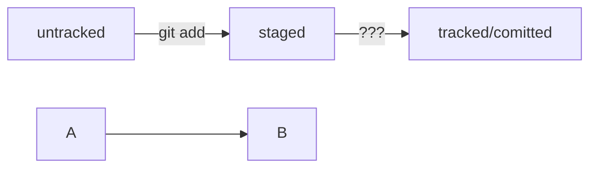

# **Базовые команды, необходимые для освоения интерфейса командной строки Git**

## Информационные команды и их описание

| Команда | Описание |
| ------- | ---------|
|**git config user.name** |**Задать имя пользователя** |
|**git config user.email**|**Задать адрес электронной почты** |
|**git init**|**Инициализировать репозиторий**|
|**git status**|**Проверить статус репозитория**|
|**git add**|**Подготовить файлы к сохранению**|
|**git commit -m 'Описание комита'**|**Внести изменения однострочным сообщением или через редактор**|
|**git remote add**|** Привязать удалённый репозиторий к локальному. Пример: git remote add origin git@github.com:%ИМЯ_АККАУНТА%/%ИМЯ_ЛОКАЛЬНОГО_РЕПОЗИТОРИЯ% 
|**git push**|**Отправить изменения на удалённый репозиторий**|
|**git log -p**|**Просмотреть истории коммитов с изменениями**|

# **mermaid-схема для наглядности описания работы с командной строкой Git**
